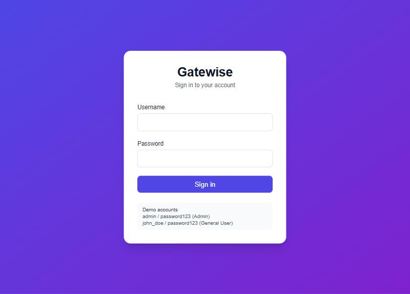
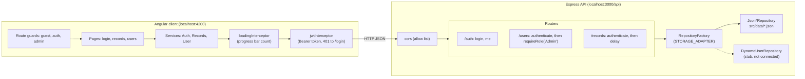
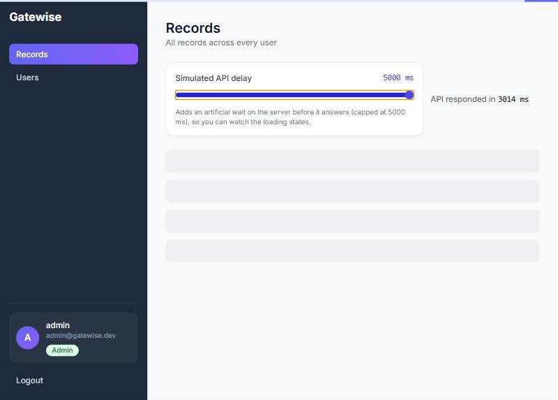
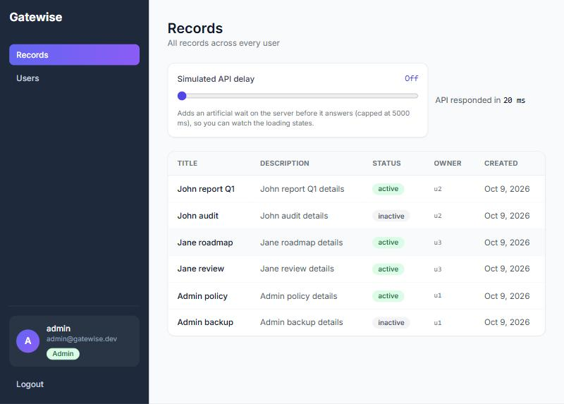
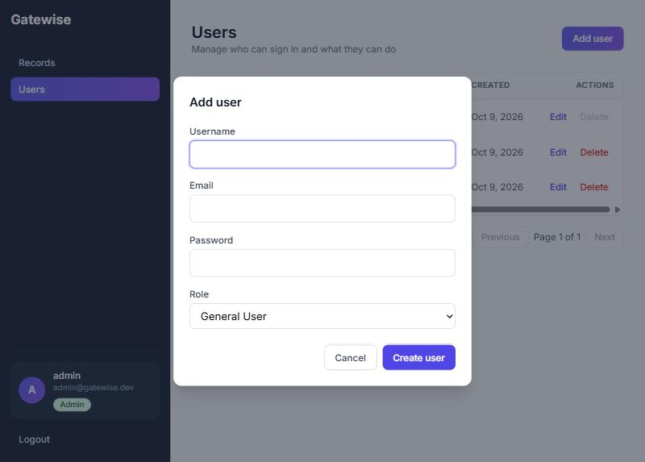

# Gatewise

Gatewise is a role-based access control (RBAC) portal. Users sign in with a username and password and get a JWT. What they can see and do depends on their role, `Admin` or `General User`, and the API enforces it on every route.



## Features

- JWT login with bcrypt-hashed passwords. The role always comes from the stored user, never from the request.
- Role-based records view: Admins see every record, General Users only their own.
- Admin user management: list, create, edit and delete users, with client-side pagination, validation, a confirm step for deletes and toast notifications. Server rules prevent deleting your own account and removing or demoting the last Admin.
- Async demo: a slider adds a simulated server delay (0 to 5000 ms). It shows the skeleton loader, the top progress bar, request cancellation and the measured response time.
- Responsive layout: a sidebar on desktop and a toggled top bar on phones.
- Pluggable storage behind a repository interface: a JSON file adapter, plus a DynamoDB adapter stub.

## Tech stack

| Layer | Technology |
| --- | --- |
| Runtime | Node.js 22 |
| Server | Express 5.2, TypeScript 5.9, zod 4 (validation), jsonwebtoken 9 (HS256), bcryptjs 3, cors, dotenv |
| Client | Angular 17.3 (standalone components, new control flow, functional guards and interceptors), RxJS 7.8, TypeScript 5.4 |
| Styling | Tailwind CSS 3.4, PostCSS, Autoprefixer, Inter font |
| Tests | Karma + Jasmine (client unit tests, ChromeHeadless) |

## Architecture



Requests flow through the client interceptors (loading counter, then token), hit the API's CORS allow list, then the router's middleware chain. For records, the chain is `authenticate`, then `delay`, then the handler. For users, it is `authenticate`, then `requireRole('Admin')`, then the handler. Handlers talk only to repository interfaces, so the storage adapter can be swapped.

## Repository structure

```
client/                       Angular 17 SPA
  src/app/
    app.config.ts             router + HttpClient with loading and JWT interceptors
    app.routes.ts             lazy standalone routes and guards
    core/
      guards/                 auth.guard, admin.guard, guest.guard
      interceptors/           jwt.interceptor, loading.interceptor
      models/                 record.model, user.model
      services/               auth, records, user, toast, loading
    features/
      auth/                   login.component
      dashboard/              dashboard-shell, user-card, records-table, delay-picker, records-stream
      admin/                  user-list, user-form, pagination
    shared/
      components/             role-badge, skeleton-loader, toast, confirm-dialog, progress-bar
      pipes/                  role-badge.pipe
  src/environments/           environment.ts, environment.prod.ts (apiUrl)
server/                       Express + TypeScript API
  src/
    index.ts                  app setup, CORS, route mounting
    config/env.ts             environment variables
    middleware/               auth.middleware (authenticate, requireRole), delay.middleware
    routes/                   auth.routes, users.routes, records.routes
    storage/                  repository interfaces, JSON adapters, Dynamo stub, RepositoryFactory
    types/                    User, RecordItem, Role, JWTPayload, Express Request typing
    data/                     users.json, records.json (seed data)
  scripts/seed.ts             writes the seed data files
docs/
  DECISIONS.md                architecture decision records
  screenshots/                images used in this README
```

## Getting started

Prerequisites: Node.js 22 (or 20+) and npm.

### Server

```bash
cd server
npm install
cp .env.example .env        # then set JWT_SECRET to a long random string
npm run seed                # optional: rewrite src/data with fresh seed users and records
npm run dev                 # http://localhost:3000, restarts on change
```

Production build:

```bash
npm run build               # compiles to dist/ and copies src/data to dist/src/data
npm start                   # node dist/src/index.js (uses the data copy in dist)
```

### Client

```bash
cd client
npm install
npm start                   # ng serve on http://localhost:4200
npx ng build                # production build to dist/client/browser
```

Open http://localhost:4200 and sign in with a seed account.

### Environment variables (server)

| Variable | Default | Description |
| --- | --- | --- |
| `PORT` | `3000` | Port the API listens on |
| `JWT_SECRET` | none (required) | Secret used to sign and verify HS256 tokens. The server will not start without it. |
| `STORAGE_ADAPTER` | `json` | `json` uses the files in `src/data`. `dynamo` selects the DynamoDB stub, which throws "Not implemented". |
| `CLIENT_ORIGIN` | `http://localhost:4200` | Comma-separated list of browser origins allowed by CORS |

The client's API base URL is set in `client/src/environments/environment.ts` (development) and `environment.prod.ts` (production builds).

### Seed users

All seed users have the password `password123`.

| Username | Role | Email | Records |
| --- | --- | --- | --- |
| `admin` | Admin | admin@gatewise.dev | r5, r6 |
| `john_doe` | General User | john@gatewise.dev | r1, r2 |
| `jane_doe` | General User | jane@gatewise.dev | r3, r4 |

`npm run seed` overwrites `server/src/data/users.json` and `records.json` with these 3 users and 6 records. It generates new bcrypt hashes and timestamps each time, so the files change in Git even though the data is the same. The committed seed files already work, so seeding is only needed to reset data after testing.

## API reference

Base URL: `http://localhost:3000/api`. Authenticated routes need `Authorization: Bearer <token>`.

| Method | Path | Auth | Role | Description | Status codes |
| --- | --- | --- | --- | --- | --- |
| GET | `/health` | No | None | Liveness check, returns `{"status":"ok"}` | 200 |
| POST | `/auth/login` | No | None | Body `{ username, password }`. Returns `{ token, user: { id, username, role, email } }`. Any `role` in the body is ignored. | 200, 400 missing fields, 401 invalid credentials, 500 |
| GET | `/auth/me` | Yes | Any | Returns the token payload `{ userId, username, role, iat, exp }` | 200, 401 |
| GET | `/users` | Yes | Admin | Lists users (never includes `passwordHash`) | 200, 401, 403 |
| POST | `/users` | Yes | Admin | Body `{ username (3-30), email, password (8+), role }`. Usernames are unique, ignoring case. | 201, 400 with `errors[]`, 401, 403, 409 duplicate username |
| PUT | `/users/:id` | Yes | Admin | Partial update of the same fields (at least one). A new password is re-hashed. | 200, 400 (validation or "Cannot demote the last Admin"), 401, 403, 404, 409 |
| DELETE | `/users/:id` | Yes | Admin | Deletes a user | 204, 400 ("You cannot delete your own account" or "Cannot delete the last Admin"), 401, 403, 404 |
| GET | `/records?delay=<ms>` | Yes | Any | Admin gets all records, a General User only their own. The optional `delay` waits 0 to 5000 ms before running the handler. | 200, 401, 500 |

Validation errors use the format `{ "message": "Validation failed", "errors": [{ "field": "email", "message": "..." }] }`. Other errors use `{ "message": "..." }`.

## How the delay demo works

1. **Slider:** `DelayPickerComponent` is a range input (0 to 5000 ms, step 250, keyboard accessible). It emits through `debounceTime(300)` and `distinctUntilChanged()`, so dragging sends one request after the slider settles, not one per step.
2. **Stream:** `RecordsTableComponent` feeds the delay (and the Retry button) into `createRecordsStream`. That function uses `switchMap`, so a new value unsubscribes from the previous request. Angular aborts the old XHR, and a slow older response can never overwrite a newer one. Each request emits `loading`, then `ready` (with the elapsed time from `performance.now()`) or `error`.
3. **Service:** `RecordsService.getRecords(delay)` adds `?delay=` only when the value is above 0.
4. **Server:** the records router runs `authenticate` first, then `delay`, so anonymous callers get an immediate 401 and can never tie up the server. The delay middleware parses the value and clamps it to 0 to 5000 ms. Anything non-numeric, negative or repeated means no delay. Then it waits with `setTimeout`.
5. **Feedback:** while the request is pending, the table shows the skeleton loader. `loadingInterceptor` counts in-flight API calls, and `LoadingService` shows the top progress bar once a call has run for 100 ms, so fast calls do not flicker. When the response arrives, the page shows "API responded in N ms".



## Security notes

- **Passwords:** hashed with bcrypt (cost 10) and never returned by the API.
- **Tokens:** JWTs are signed and verified with HS256 only (`algorithms: ['HS256']`) and expire after 1 hour.
- **Roles:** the role inside the token is copied from the stored user at login. A `role` sent in the login body is ignored, and the login form has no role selector.
- **Login errors:** an unknown username and a wrong password both return the same `401 Invalid credentials`. Unknown usernames are compared against a dummy bcrypt hash, so the response time does not reveal whether a username exists.
- **Authorization:** the Admin routes are protected on the server by `requireRole('Admin')`. The client guards only improve the UX.
- **CORS:** an explicit allow list (`CLIENT_ORIGIN`). Unknown origins get no `Access-Control-Allow-Origin` header.
- **Token storage:** the client keeps the token in `localStorage` and sends it as a Bearer header. That is simple, but readable by any XSS. The mitigations are Angular template escaping, no `innerHTML`, the 1-hour expiry, and server-side checks on every route. See ADR-009.
- **Session expiry:** the client checks the token's `exp` on startup and on every guard check. Any 401 from the API logs the user out and returns them to `/login`.

## Testing

### Client unit tests

```bash
cd client
npx ng test --watch=false --browsers=ChromeHeadless
```

30 specs cover:
- token expiry parsing and session restore
- the auth and admin guards
- the role badge pipe
- `RecordsService` and the `?delay` param
- `ToastService` auto-dismiss
- the pagination helper
- `LoadingService` counting and the show delay
- the loading interceptor (counts only API calls; decrements on error and cancel)
- the records stream (the latest delay wins over a slower earlier response)

### API checks

The API was verified manually with curl against a running server, for example:

```bash
# Log in and keep the token
TOKEN=$(curl -s -X POST http://localhost:3000/api/auth/login \
  -H "Content-Type: application/json" \
  -d '{"username":"admin","password":"password123"}' | sed -E 's/.*"token":"([^"]+)".*/\1/')

# Authenticated request
curl -H "Authorization: Bearer $TOKEN" http://localhost:3000/api/auth/me

# Admin-only endpoint
curl -H "Authorization: Bearer $TOKEN" http://localhost:3000/api/users

# Records with a 1.5 s simulated delay
curl -w '\n%{http_code} %{time_total}s\n' -H "Authorization: Bearer $TOKEN" \
  "http://localhost:3000/api/records?delay=1500"
```

The UI was checked in a browser for each feature: login and guards, role-based records, user management, the delay demo, phone and desktop layouts.

## Screenshots

| | |
| --- | --- |
| Login |  |
| Records as Admin, with the delay picker and response time |  |
| Records loading with a 5000 ms delay (skeleton and top progress bar) |  |
| User management with the Add user dialog |  |

## Deployment notes

The project runs locally without any cloud services. One free-hosting setup:

**API on Render (web service)**
- Root directory: `server`
- Build command: `npm install && npm run build`
- Start command: `npm start`
- Environment variables:
  - `JWT_SECRET`: a long random string
  - `STORAGE_ADAPTER=json`
  - `CLIENT_ORIGIN`: the deployed client URL, e.g. `https://gatewise.vercel.app`
  - `PORT` is provided by Render.
- `npm run build` compiles TypeScript and copies `src/data` to `dist/src/data`, which is where the compiled server reads and writes its JSON files.

**Client on Vercel or Netlify**
- Root directory: `client`
- Build command: `npx ng build`
- Output directory: `dist/client/browser`
- Add an SPA rewrite so every path serves `index.html`:
  - Vercel: a rewrite of `/(.*)` to `/index.html`
  - Netlify: `/* /index.html 200` in `_redirects`
- Before building, set `apiUrl` in `client/src/environments/environment.prod.ts` to the deployed API, e.g. `https://gatewise-api.onrender.com/api`.

## Known limitations

- **Stale roles:** the role in a token is trusted until the token expires (up to 1 hour). A user who is demoted or deleted keeps access until then.
- **JSON storage:** it suits a single instance only. Writes are atomic, but there is no locking across processes, so it is not meant for production.
- **DynamoDB:** the adapter is a stub. Every method throws "Not implemented", and there is no records adapter for Dynamo yet.
- **Data resets on Render's free tier:** the file system is ephemeral, so created or changed users are lost on restart or redeploy.
- **Missing auth features:** no refresh tokens, password reset, account lockout or rate limiting.
- **Pagination:** the users list is paginated in the browser, after loading all users.
- **Unused dependency:** the `uuid` package is still listed in `server/package.json` but unused. ids come from `crypto.randomUUID()` (see ADR-010).

## Project workflow

Each step of the build was done on its own branch, with Conventional Commit messages, and merged into `main` through a pull request:

`chore/repo-setup`, `feat/server-scaffold`, `feat/auth-api`, `feat/users-api`, `feat/records-api`, `feat/client-scaffold`, `feat/auth-ui`, `feat/dashboard-and-admin-ui`, `feat/async-demo-and-docs`

Architecture decisions are recorded in [docs/DECISIONS.md](docs/DECISIONS.md).
